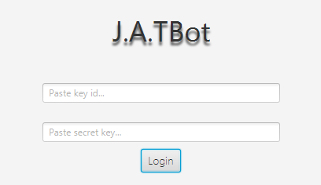

  

<h1 align="center" style="color:#FFC66D;">Java Algorithmic Trading Bot</h1>

This project is a Java-based algorithmic trading bot with development officially beginning on November 28th, 2023. 
This bot will be capable of using various strategies and algorithms to make trading decisions. The bot will adhere
to strict or lenient risk management tools based on the user's implementation.

<h1 align="center" style="color:#CC7832;">DISCLAIMER</h1>

Please be aware that the use of our Java Algorithmic Trading Bot is at your own discretion and risk.
The developers are not to be held responsible for ANY loss of money or assets that hold real-world 
cash value resulting from the use of this tool. It is strongly recommended that you understand the risks
involved with algorithmic trading and use this bot responsibly. If you aren't knowledgable in trading,
we advise you seek help from an accredited financial adviser prior so you understand how to use our
bot effectively and safely.

<h2 align="center" style="color:#CC7832;">Dependencies</h2>

The project uses the following dependencies:
`- Alpaca API: For interacting with the Alpaca trading platform.
- Okio: A modern I/O library for Android and Java.
- Gson: A Java library for converting Java Objects into their JSON representation and vice versa.
- JavaFX: A graphics and media package for creating rich client applications.
- SLF4J Simple: A simple implementation of SLF4J API used for testing, development, and logging in this project.`
Please refer to the `.classpath` file for the specific versions of these dependencies.

<h2 align="center" style="color:#CC7832;">Setup</h2>

JRE 21 may be needed. 
You will also need to modify the `alpaca.properties` file with your Alpaca API credentials.

<h2 align="center" style="color:#CC7832;">Usage</h2>

  

[to be completed]
